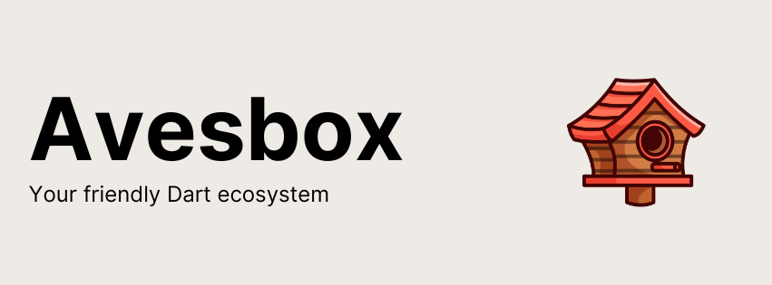

# Welcome to Avesbox

A Dart 🎯 ecosystem of amazing birds and libraries.

## Our mission

At Avesbox, our mission is to empower developers by expanding the capabilities of Dart on the backend through innovative, open-source libraries. We believe in the strength of community-driven collaboration, fostering an environment where developers of all backgrounds can contribute, learn, and grow together. By making our tools accessible to everyone, we strive to accelerate the adoption of Dart in backend development, pushing the boundaries of what's possible while ensuring a seamless and efficient developer experience. Together we can build the future of backend development with Dart.

## Projects

| Name | Description | Version |
| ------------ | ------------------------------------------------ | ----------------- |
| [Acanthis](https://github.com/avesbox/acanthis) | Simple and easy-to-use validation library for Flutter and Dart inspired by Zod |  |
| [Frontier](https://github.com/avesbox/frontier) | Frontier is a simple, flexible, and unobtrusive authentication library for Dart. |  |
| [Frontier Strategy](https://github.com/avesbox/frontier) | Frontier is a simple, flexible, and unobtrusive authentication library for Dart. |  |
| [Secure Session](https://github.com/avesbox/secure_session) | Secure stateless cookie session  |  |
| [Microdiff](https://github.com/avesbox/microdiff) | Microdiff is a fast, zery dependency object and array comparison library |  |
